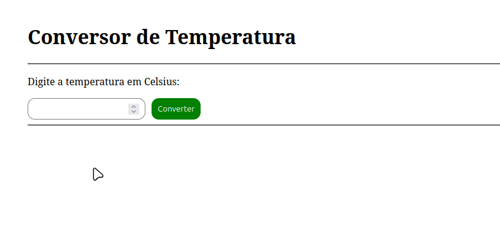

# Conversor de Temperatura

Segue um curto vídeo do sistema em funcionamento:



## Aprendizados:

- `CommonModule`: fornece diretivas e pipes comuns essenciais para a construção de aplicativos, como `*ngIf` e `*ngFor`.

    - `*ngIf`: Uma diretiva estrutural que **mostra ou esconde** um elemento do DOM condicionalmente.

    Exemplo:

    ```ts
    @Component({
        selector: 'app-exemplo',
        imports: [CommonModule],
        template: `
            <p *ngIf="mostrar">Olá, mundo!</p>
        `
    })
        export class ExemploComponent {
            mostrar = true;
    }
    
    ```

    > Se não importar o CommonModule, o Angular não vai reconhecer a diretiva.

### Fixação:

- `[(ngModel)]`: Um **two-way data binding** — ou seja, ele _liga o valor do input à variável_ do componente e vice-versa.

Exemplo:
```ts
<input type="number" [(ngModel)]="temp_celsius">
```
- `temp_celsius` sempre reflete o valor que o usuário digitou.
