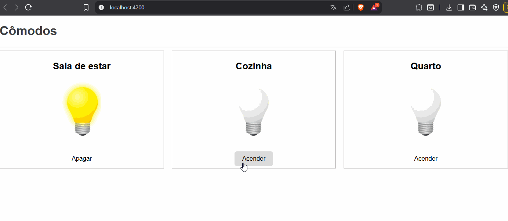

# Projeto de Lâmpadas por Cômodos

Este projeto é uma aplicação Angular simples que simula lâmpadas em diferentes cômodos. Cada lâmpada pode ser acesa ou apagada individualmente.

## Estrutura

- `src/assets/images/` → contém as imagens das lâmpadas (acesa e apagada)  
- `src/app/app.component.ts` → lógica das lâmpadas  
- `src/app/app.component.html` → layout dos cômodos  
- `src/app/app.component.css` → estilo 
